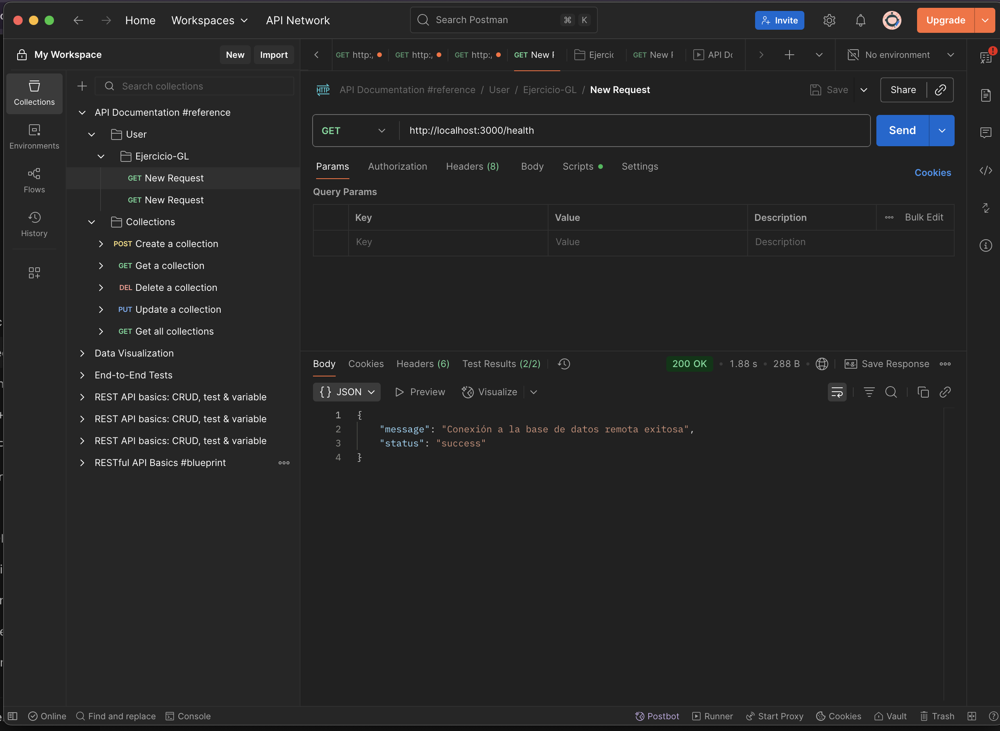
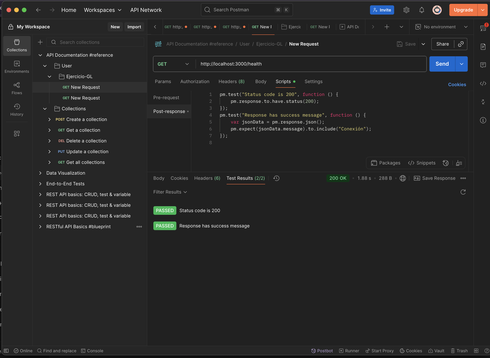
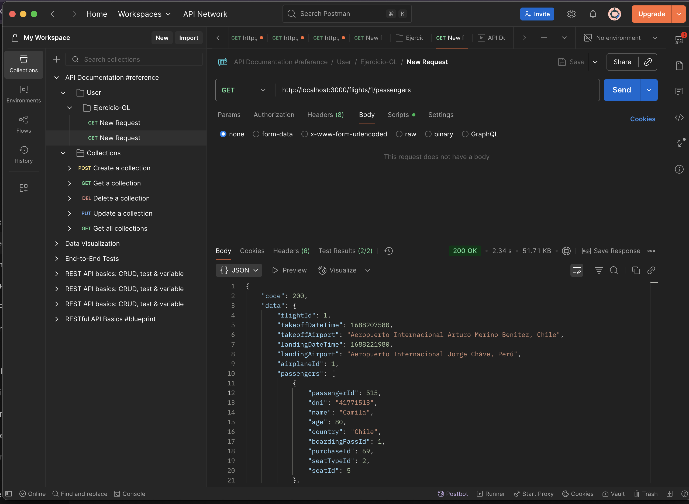
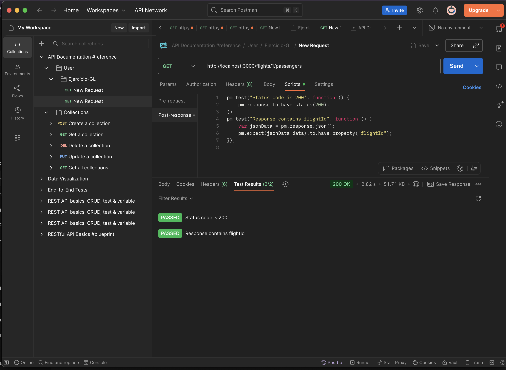
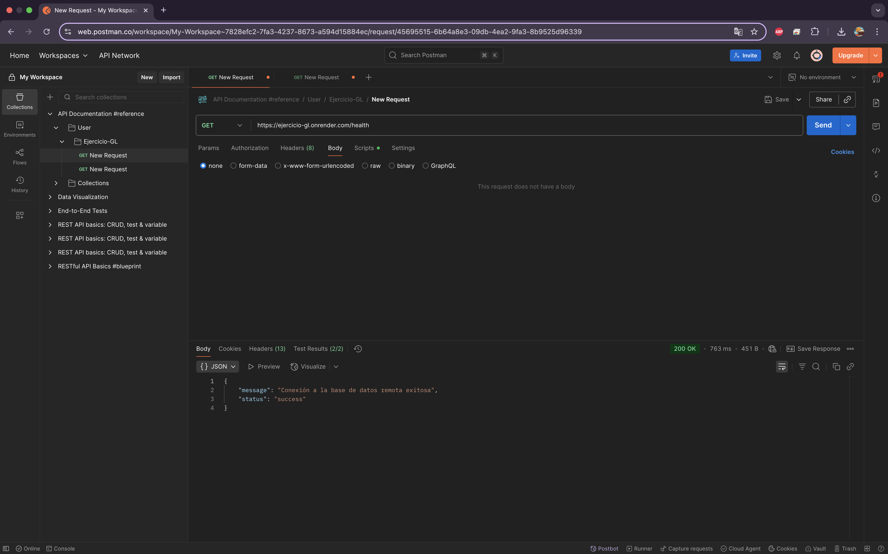
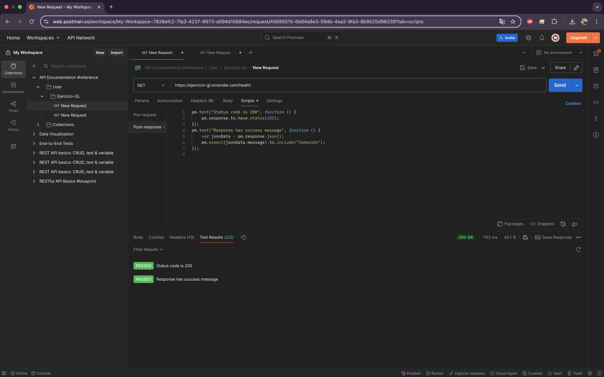
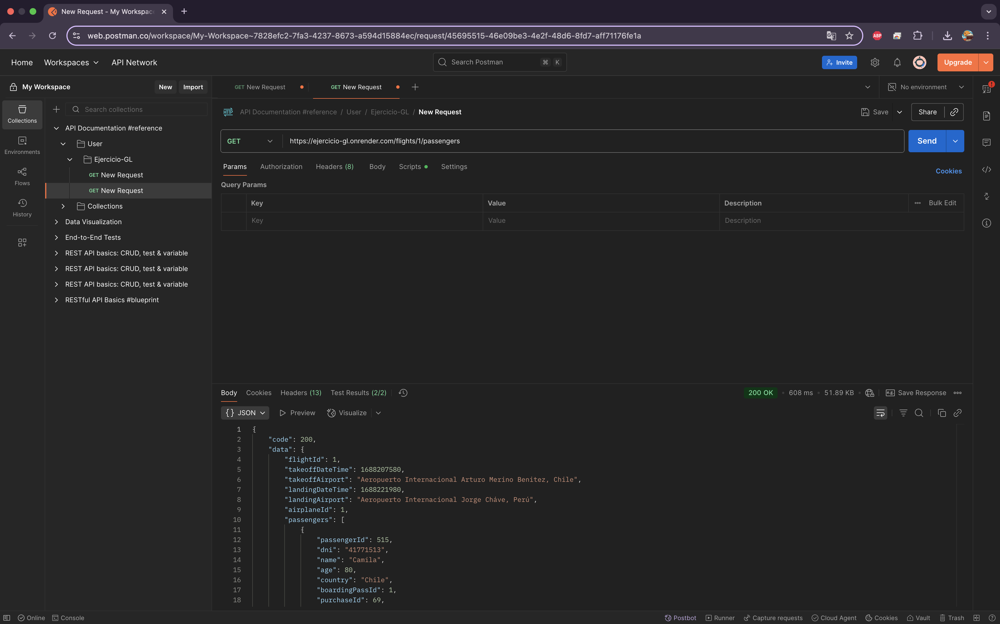
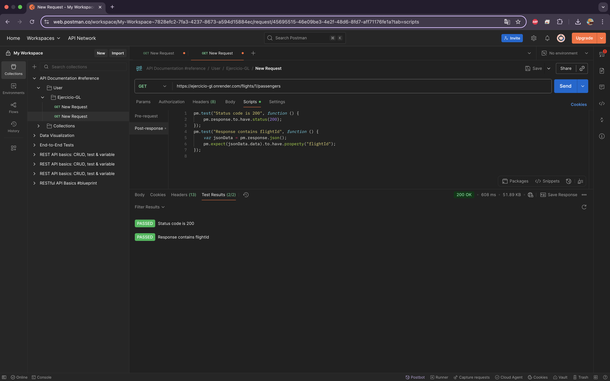
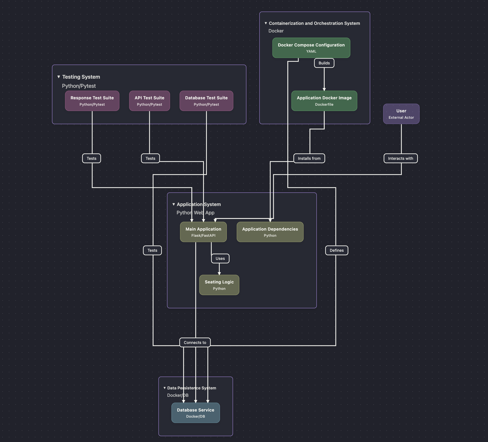

# ✈️ API de Gestión de Vuelos y Pasajeros  


[](https://ejercicio-gl.onrender.com)


🌍 **API en Producción**: [https://ejercicio-gl.onrender.com](https://ejercicio-gl.onrender.com)  

---

## 📌 Descripción del Proyecto  
Esta es una API web construida con **Flask** que gestiona la información de vuelos y pasajeros.  
Permite:  
- Consultar el estado de la API y la conexión a la base de datos.  
- Obtener los detalles de un vuelo específico y su lista de pasajeros.  
- Asignar automáticamente asientos a los pasajeros.  

La API está conectada a una base de datos **MySQL remota**, con lógica de reintentos y manejo de errores.  

---

## ⚙️ Requisitos del Sistema  
- Python 3.x  
- PIP  
- Docker y Docker Compose (opcional)  

Las dependencias del proyecto están en **requirements.txt**.  

---

## 🔑 Configuración del Entorno  
Crea un archivo `.env` en la raíz del proyecto:  

```env
DB_HOST=tu_host_de_bd
DB_USER=tu_usuario_de_bd
DB_PASS=tu_contraseña_de_bd
DB_NAME=el_nombre_de_tu_bd
DB_PORT=3306
PORT=5000
```

## 🧪 Pruebas
Los tests se ejecutan con **unittest**. Para correrlos localmente:

---

## ✅ Pruebas Unitarias

El proyecto incluye un set de pruebas automatizadas para validar la API de **Andes Airlines**.  
Estas pruebas cubren:

- Health check del servidor.
- Estructura de vuelos existentes y no existentes.
- Validación de pasajeros.
- Reglas de asignación de asientos.
- Manejo de múltiples solicitudes concurrentes.
- Reconexión de base de datos.

### Ejecución de pruebas
```bash
python test_api.py
✅ Resultados de Tests

Ejemplo de salida al correr los tests:
Ran 7 tests in 31.826s

OK
🎉 ¡Todas las pruebas pasaron!


---

## 🚀 Instalación sin Docker  

1. Clonar el repositorio:  
   
   git clone <https://github.com/Geowar17/Ejercicio-GL.git>
 
   
2. Instalar dependencias:  
   
   pip install -r requirements.txt
   
3. Ejecutar la API:  
   
   python app.py
   

La API estará en: [http://localhost:3000](http://localhost:3000)  

---


## 🐳 Ejecución con Docker  

1. Construir la imagen:  
   
   docker build -t flights-api .
   
2. Levantar con Docker Compose:  
   
   docker-compose up -d
   
3. Verificar que el contenedor está corriendo:  
   
   docker ps
   
La API estará en [http://localhost:3000](http://localhost:3000).  

---

## 📡 Endpoints Principales  


| Método  | Endpoint                          | Descripción                                               | Ejemplo Request             | Ejemplo Response                                                                                                                                                                                                                                                                                                                                                             |
| ------- | --------------------------------- | --------------------------------------------------------- | --------------------------- | ---------------------------------------------------------------------------------------------------------------------------------------------------------------------------------------------------------------------------------------------------------------------------------------------------------------------------------------------------------------------------- |
| **GET** | `/health`                         | Verifica el estado de la API y la conexión a la BD.       | `GET /health`               | `json { "code": 200, "status": "OK", "db_connection": "OK" } `                                                                                                                                                                                                                                                                                                               |
| **GET** | `/flights/<flight_id>/passengers` | Obtiene los detalles de un vuelo y su lista de pasajeros. | `GET /flights/1/passengers` | `json { "code": 200, "data": { "flightId": 1, "takeoffDateTime": 1672531200, "takeoffAirport": "SCL", "landingDateTime": 1672538400, "landingAirport": "EZE", "airplaneId": 101, "passengers": [ { "passengerId": 1, "dni": "12345678", "name": "Juan Perez", "age": 30, "country": "Chile", "boardingPassId": 10, "purchaseId": 50, "seatTypeId": 1, "seatId": 25 } ] } } ` |


## 🧪 Pruebas con Postman  

1. Abre **Postman**.  
2. Importa la colección incluida en este repositorio (`/postman/flights_api_collection.json`).  
3. Configura las variables de entorno (host, puerto, etc.).  

### 🔹 Pruebas en local  
- `http://127.0.0.1:3000/health` → Estado del servicio.  
- `http://127.0.0.1:3000/flights/1/passengers` → Lista de pasajeros del vuelo `1`.  
La siguiente imagen muestra las pruebas realizadas de manera local:  

📷 Capturas en local:

Estado del servicio
  

Estado del servicio (Test en Postman)
    

Lista de pasajeros
   

Lista de pasajeros (Test en Postman)
       


## 🌍 Pruebas en Producción (Render)

Además de probar la API en local, también puedes hacerlo sobre la instancia desplegada en Render.

1. En Postman, edita la variable `baseUrl` de la colección y cámbiala por la URL pública de tu API en Render:

   -`https://ejercicio-gl.onrender.com/`
2. Ejecuta nuevamente las pruebas:
- `/health`
- `/flights/{id}/passengers`

De esta forma puedes validar que el despliegue en Render funciona igual que en local.


- `https://ejercicio-gl.onrender.com/health`  → Estado del servicio.  
- `https://ejercicio-gl.onrender.com/flights/1/passengers`   → Lista de pasajeros del vuelo `1`.  
  
  La siguiente imagen muestra las pruebas realizadas en despliegue:  


  📷 Capturas en Render:

Estado del servicio
   

Estado del servicio (Test en Postman)
     

Lista de pasajeros
   

Lista de pasajeros (Test en Postman)
    


 


Ambas pruebas fueron exitosas ✅

## 🗂️ Arquitectura del Sistema  

La siguiente imagen muestra la arquitectura general del sistema:  

  

---

## 🔮 Mejoras Técnicas Implementadas  

- **Dataclasses** (`FlightData`, `Passenger`) para definir el orden de las claves.  
- **Serialización manual** con `json.dumps()` para evitar reordenamiento en JSON.  
- **Dockerfile + docker-compose** para despliegue rápido.  
- **Colección de Postman** para validación rápida de endpoints.  
- **Sistema de tests** con `pytest` para pruebas unitarias de lógica, API y base de datos.  

---
